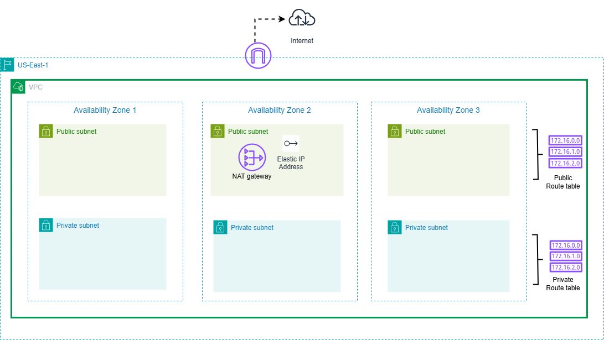

# Day 2: Setting up terraform 

## Participant Details
- **Name:** Yusuf Abdulganiyu
- **Task Completed:** 
    - Udemy Videos: Watch the following videos:
    - Video 7: "Setting Up Your AWS Account"
    - Video 8: "Installing Terraform"
    - Video 9: "First Steps with Terraform"
    - Video 10: "Understanding the Terraform Workflow"
    - Reading: Chapter 2 of "Terraform: Up & Running" by Yevgeniy (Jim) Brikman, focusing on "Setting Up Your AWS Account", "Installing Terraform. and "Deploying the first two servers"
    - Completed Bonus activity using draw.io to create diagram of lab session

    
    
- **Date and Time:** [02/12/2024 23:20 GMT +1]
