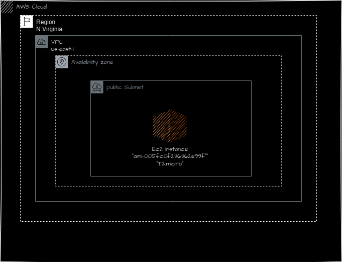

Day 2: Setting Up Your AWS Account, Installing Terraform and Deploying the first two servers
Participant Details
Name: Meh Chaeh Brandon Kum
Task Completed: 
- Set up your AWS account.
   - Read part of chapter two of the book
   - Installed Terraform locally.
   - Installed AWS CLI and configure it.
   - Installed Visual Studio Code (VSCode) and add the AWS plugin.
   - Configured  VSCode to work with AWS.
   - Deployed a single server and a web server (chapter 2 )
Date and Time: 2/12/2024 7:44 PM
Additional Notes
learned how to set environmental variables and how to deploy an instance and attach to a security group using code


Single Server
main.tf
```bash
resource "aws_instance" "Ec2instance" {
 ami = "ami-005fc0f236362e99f"
 instance_type = "t2.micro"
 tags = {
 Name = "terraform-example"
 }
}
```
Single Server Architecture



