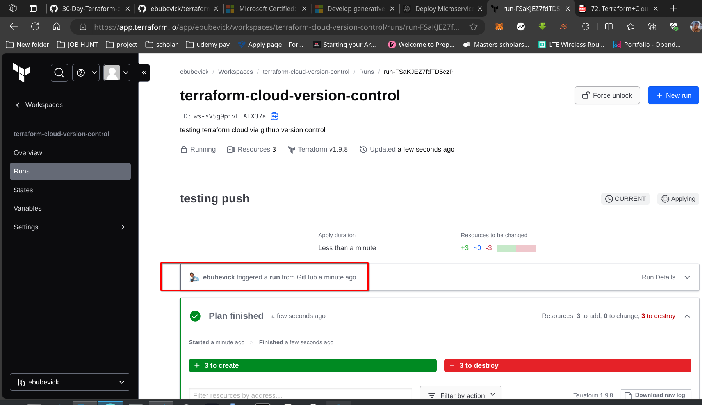

# Day 20: Workflow for Deploying Application Code

## Participant Details

- **Name:** Omekwu Victor Ebube  
- **Task Completed:** Simulated deployment process and integrated Terraform Cloud’s version control, secure variables, and private registry features.  
- **Date and Time:** 09-20-2024 at 14:30 PM IST

---

## Terraform Cloud Configuration

To set up your Terraform Cloud integration, you’ll need to define the cloud block in your Terraform configuration like so:

```hcl
terraform {
  cloud {
    organization = "ebubevick"
    
    workspaces {
      name = "terraform-cloud-version-control"
    }
  }
}
```

This config connects your local setup to your Terraform Cloud organization and tells Terraform which workspace (`terraform-cloud-version-control`) to use when deploying the app.

## GitHub Repository for Version Control

Terraform Cloud integrates with GitHub to automatically trigger deployments when you push new commits. I’ve used the following GitHub repository for version control:

[GitHub Repo for Version Control](https://github.com/ebubevick/terraform-cloud-version-control.git)

Each time a commit is made, Terraform Cloud picks up the changes and triggers the corresponding workspace to run the infrastructure updates.

## How It Works

1. **Commit to GitHub:** Push any code changes to the repository.
2. **Trigger Deployment:** Terraform Cloud detects the changes and triggers a run in the configured workspace.
3. **Automated Deployment:** Terraform applies the changes, updating the infrastructure as needed.

This setup automates the deployment pipeline, allowing updates to happen smoothly and efficiently each time the code is updated in GitHub.

---

