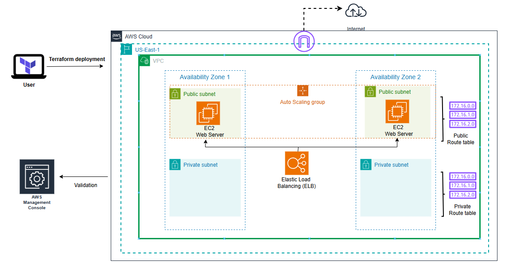

# Day 5: Scaling Infrastructure

## Participant Details
- **Name:** Yusuf Abdulganiyu
- **Task Completed:** 
    1. Reading
        - Chapter: Completed reading Chapter 2 and started Chapter 3 how to manage Terraform state. Sections: "Scaling Infrastructure" and "Terraform State".

    2. Videos
        - Udemy: Watch the following videos:
            "Terraform data block " (Video 21)
            "Terraform configuration block" (Video 22)
            "Terraform module block" (Video 23)
            "Terraform output block " (Video 24)

    3. Activity
        - Scale Infrastructure: Use Terraform to scale your web server cluster to handle increased load.
        - understand State: understand the concept of state. what happens when you manully update the state file.

    4. Blog Post
        - Title: "Scaling Infrastructure with Terraform: The Crucial Role of State Management"
    5. Social Media Post
        
- **Date and Time:** [05/12/2024 23:20 GMT +1]


# Design Infrastructure




# Code 

```bash
# providers.tf

terraform {
  required_providers {
    aws = {
      source  = "hashicorp/aws"
      version = "~> 5.0"
    }
  }
}

provider "aws" {
  region = "us-east-1"
 }

```


```bash
# data.tf

#Retrieve the list of AZs in the current AWS region
data "aws_region" "default" {}
data "aws_availability_zones" "available" {}

data "aws_ami" "ubuntu" {
  most_recent = true

  filter {
    name   = "name"
    values = ["ubuntu/images/hvm-ssd/ubuntu-jammy-22.04-amd64-server-*"]
  }

  filter {
    name   = "virtualization-type"
    values = ["hvm"]
  }

  owners = ["099720109477"] # Canonical
}

```

```bash
# main.tf

#################### Deploy VPC, Subnets, Internet Gateway, and Route Table #######################################

# Define the VPC
resource "aws_vpc" "vpc" {
  cidr_block = var.cidr_block
  tags = {
    Name        = "webserver_vpc"
    Environment = var.env
  }
}

# Deploy public subnets in multiple AZs
# Filter for only 2 availability zones
locals {
  selected_azs = slice(data.aws_availability_zones.available.names, 0, 2)
}

# Deploy public subnets in the selected AZs
resource "aws_subnet" "public_subnets" {
  count                    = length(local.selected_azs)
  vpc_id                  = aws_vpc.vpc.id
  cidr_block              = cidrsubnet(var.cidr_block, 8, count.index)
  availability_zone       = local.selected_azs[count.index]
  map_public_ip_on_launch = true

  tags = {
    Name = "demo_public_subnet_${count.index + 1}"
  }
}

# Deploy private subnets in the selected AZs
resource "aws_subnet" "private_subnets" {
  count                    = length(local.selected_azs)
  vpc_id                  = aws_vpc.vpc.id
  cidr_block              = cidrsubnet(var.cidr_block, 8, count.index + 2)
  availability_zone       = local.selected_azs[count.index]

  tags = {
    Name = "demo_private_subnet_${count.index + 1}"
  }
}

# Create Internet Gateway
resource "aws_internet_gateway" "internet_gateway" {
  vpc_id = aws_vpc.vpc.id
  tags = {
    Name = "${var.env}_igw"
  }
}

# Create route table for public subnets
resource "aws_route_table" "public_route_table" {
  vpc_id = aws_vpc.vpc.id
  route {
    cidr_block = "0.0.0.0/0"
    gateway_id = aws_internet_gateway.internet_gateway.id
  }

  tags = {
    Name = "${var.env}_public_rtb"
  }
}

# Associate public subnets with the route table
resource "aws_route_table_association" "public_subnet_assoc" {
  count          = length(aws_subnet.public_subnets)
  route_table_id = aws_route_table.public_route_table.id
  subnet_id      = aws_subnet.public_subnets[count.index].id
}

#################### Security Group #######################################

# Create Security Group
resource "aws_security_group" "web_sg" {
  name        = "webserver_sg"
  description = "Allow HTTP and SSH traffic"
  vpc_id      = aws_vpc.vpc.id

  ingress {
    from_port   = 80
    to_port     = 80
    protocol    = "tcp"
    cidr_blocks = ["0.0.0.0/0"]
  }
  
  ingress {
    from_port   = 22
    to_port     = 22
    protocol    = "tcp"
    cidr_blocks = ["0.0.0.0/0"]
  }

  egress {
    from_port   = 0
    to_port     = 0
    protocol    = "-1"
    cidr_blocks = ["0.0.0.0/0"]
  }

  tags = {
    Name = "${var.env}_webserver_sg"
  }
}

#################### Load Balancer Setup #######################################

# Create Load Balancer
resource "aws_lb" "web_lb" {
  name               = "webserver-lb"
  internal           = false
  load_balancer_type = "application"
  security_groups    = [aws_security_group.web_sg.id]
  subnets            = aws_subnet.public_subnets[*].id

  enable_deletion_protection = false

  tags = {
    Name = "${var.env}_lb"
  }
}

# Create Target Group with Health Check
resource "aws_lb_target_group" "web_tg" {
  name        = "webserver-tg"
  port        = var.port
  protocol    = var.protocol
  vpc_id      = aws_vpc.vpc.id
  target_type = "instance"

  health_check {
    path                = "/"
    interval            = 30
    timeout             = 5
    healthy_threshold   = 2
    unhealthy_threshold = 2
    matcher             = "200"
  }

  tags = {
    Name = "${var.env}_tg"
  }
}

# Create Listener for Load Balancer
resource "aws_lb_listener" "web_listener" {
  load_balancer_arn = aws_lb.web_lb.arn
  port              = var.port
  protocol          = var.protocol
  default_action {
    type             = "forward"
    target_group_arn = aws_lb_target_group.web_tg.arn
  }
}

#################### Launch Template #######################################

resource "aws_launch_template" "web_lt" {
  name          = "webserver-launch-template"
  instance_type = var.instance_type
  image_id      = data.aws_ami.ubuntu.id

  user_data = base64encode(<<-EOF
    #!/bin/bash
    apt-get update -y
    apt-get install -y apache2
    systemctl start apache2
    systemctl enable apache2
    echo "<html><h1>Welcome to your Auto-Scaled Apache Web Server</h1></html>" > /var/www/html/index.html
  EOF
  )

  tag_specifications {
    resource_type = "instance"
    tags = {
      Name = "${var.env}_instance"
    }
  }
  # Required when using a launch configuration with an auto scaling group.
    lifecycle {
        create_before_destroy = true
    }
}

#################### Auto Scaling Group #######################################

resource "aws_autoscaling_group" "web_asg" {
  desired_capacity     = 2
  max_size             = 3
  min_size             = 1
  vpc_zone_identifier  = aws_subnet.public_subnets[*].id
  launch_template {
    id      = aws_launch_template.web_lt.id
    version = "$Latest"
  }

  health_check_type    = "ELB"
  health_check_grace_period = 300

  target_group_arns = [aws_lb_target_group.web_tg.arn]

  tag  {
      key                 = "Name"
      value               = "${var.env}_asg"
      propagate_at_launch = true
    }
}


```
```bash
# variables.tf
variable "cidr_block" {
    default = "10.0.0.0/16"  
}


variable "env" {
    default = "demo_env"  
}

variable "port" {
    default = 80  
}

variable "instance_type" {
    default = "t2.micro"  
}

variable "protocol" {
    default = "HTTP"  
}

```


```bash
# output.tf
output "lb_dns_name" {
    value = aws_lb.web_lb.dns_name  
}

output "user_data" {
  value = base64decode(aws_launch_template.web_lt.user_data)
}


```


--- 
- Additional notes:
    - Understood the concepts of scaling infrastructure and the importance of managing Terraform state.
    - Understood how the different block operate and when to use them in your terraform code .
    - Successfully Deployed a load balancer and understand state 