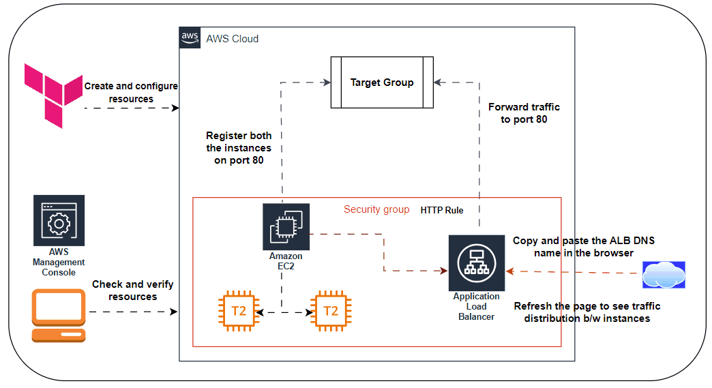

# Day 5: Scaling Infrastructure

## Participant Details

- **Name:** Vijayaraghavan Vashudevan
- **Task Completed:** Learnt - How to use concepts of scaling infrastructure and the importance of managing Terraform state and Understanding how the different blocks operate and when to use them.
- **Date and Time:** 26-08-2024 at 21:30 pm IST

### main.tf
```bash
# Configure the AWS Provider
provider "aws" {
  region = "us-east-1"
}

# Security Group for EC2 & ELB
resource "aws_security_group" "web-server" {
  name        = "web-server"
  description = "Allow incoming HTTP Connections"
  ingress {
    from_port   = 80
    to_port     = 80
    protocol    = "tcp"
    cidr_blocks = ["0.0.0.0/0"]
  }
  egress {
    from_port   = 0
    to_port     = 0
    protocol    = "-1"
    cidr_blocks = ["0.0.0.0/0"]
  }
}

# Creating 2 EC2 Instances
resource "aws_instance" "web-server" {
  ami             = "ami-066784287e358dad1"
  instance_type   = "t2.micro"
  count           = 2
  key_name        = "terraform-key"
  security_groups = ["${aws_security_group.web-server.name}"]
  user_data       = <<-EOF
       #!/bin/bash
       sudo su
        yum update -y
        yum install httpd -y
        systemctl start httpd
        systemctl enable httpd
        echo "<html><h1> Welcome to Terraform Challenge. Happy Learning from $(hostname -f)...</p> </h1></html>" >> /var/www/html/index.html
        EOF
  tags = {
    Name = "instance-${count.index}"
  }
}

# default vpc and subnet-id's
data "aws_vpc" "default" {
  default = true
}

data "aws_subnet" "subnet1" {
  vpc_id            = data.aws_vpc.default.id
  availability_zone = "us-east-1a"
}

data "aws_subnet" "subnet2" {
  vpc_id            = data.aws_vpc.default.id
  availability_zone = "us-east-1b"
}

#target-group creation
resource "aws_lb_target_group" "target-group" {
  health_check {
    interval            = 10
    path                = "/"
    protocol            = "HTTP"
    timeout             = 5
    healthy_threshold   = 5
    unhealthy_threshold = 2
  }
  name        = "terr-tg"
  port        = 80
  protocol    = "HTTP"
  target_type = "instance"
  vpc_id      = data.aws_vpc.default.id
}

#application-loadbalancer creation
resource "aws_lb" "application-lb" {
  name               = "whiz-alb"
  internal           = false
  ip_address_type    = "ipv4"
  load_balancer_type = "application"
  security_groups    = [aws_security_group.web-server.id]
  subnets = [
    data.aws_subnet.subnet1.id,
    data.aws_subnet.subnet2.id
  ]
  tags = {
    Name = "terr-alb"
  }
}

#listener-creation
resource "aws_lb_listener" "alb-listener" {
  load_balancer_arn = aws_lb.application-lb.arn
  port              = 80
  protocol          = "HTTP"
  default_action {
    target_group_arn = aws_lb_target_group.target-group.arn
    type             = "forward"
  }
}

#attach targetgroup to alb
resource "aws_lb_target_group_attachment" "ec2_attach" {
  count            = length(aws_instance.web-server)
  target_group_arn = aws_lb_target_group.target-group.arn
  target_id        = aws_instance.web-server[count.index].id
}   
```
### terraform.tf
```bash
terraform {
  required_version = ">= 1.0.0"
  required_providers {
    aws = {
      source  = "hashicorp/aws"
      version = "~> 3.0"
    }
    random = {
      source  = "hashicorp/random"
      version = "3.1.0"
    }
  }
}
```
### output.tf
```bash
output "elb-dns-name" {
  value = aws_lb.application-lb.dns_name
}   
```
### Architecture/Flow Diagram of Web-App Server using Terraform


