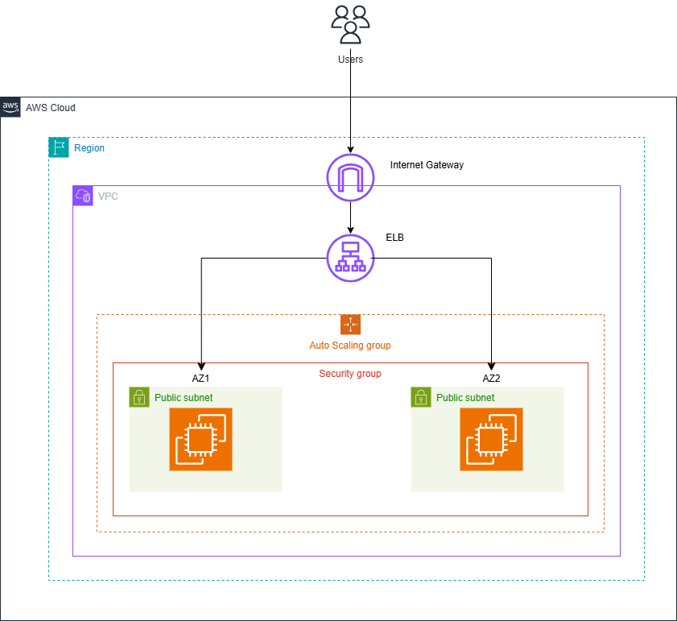

provider "aws" {
  region = "us-east-1"
}

# Variable for SSH Key
variable "key_name" {
  description = "Key pair for SSH access"
}

# Security Group
resource "aws_security_group" "web_sg" {
  name        = "web_sg"
  description = "Allow HTTP and SSH"

  ingress {
    from_port   = 80
    to_port     = 80
    protocol    = "tcp"
    cidr_blocks = ["0.0.0.0/0"]
  }

  ingress {
    from_port   = 22
    to_port     = 22
    protocol    = "tcp"
    cidr_blocks = ["0.0.0.0/0"]
  }

  egress {
    from_port   = 0
    to_port     = 0
    protocol    = "-1"
    cidr_blocks = ["0.0.0.0/0"]
  }
}

# SNS Topic for Alarm Notifications
resource "aws_sns_topic" "alarm_topic" {
  name = "ec2-cpu-alarm-topic"
}

# SNS Topic Subscription (Email)
resource "aws_sns_topic_subscription" "email_subscription" {
  topic_arn = aws_sns_topic.alarm_topic.arn
  protocol  = "email"
  endpoint  = "otumiky@gmail.com" # Replace with your email address
}    

# Launch Template
resource "aws_launch_template" "web_launch_template" {
  name          = "web-server-template"
  image_id      = "ami-0453ec754f44f9a4a" # Amazon Linux 2
  instance_type = "t2.micro"
  key_name      = var.key_name

   user_data = base64encode(<<-EOF
              #!/bin/bash
              sudo yum update -y
              sudo yum install -y httpd
              sudo systemctl start httpd
              sudo systemctl enable httpd
              echo "Hello from Server $(hostname)" > /var/www/html/index.html
              EOF
  )

  network_interfaces {
    security_groups = ["sg-0a189155b7cc342c0"]
  }

  tag_specifications {
    resource_type = "instance"
    tags = {
      Name = "web-server"
    }
  }
}

# Auto Scaling Group
resource "aws_autoscaling_group" "web_asg" {
  desired_capacity     = 2
  max_size             = 5
  min_size             = 1
  launch_template {
    id      = aws_launch_template.web_launch_template.id
    version = "$Latest"
  }

  vpc_zone_identifier = ["subnet-036596d61d8685f5a", "subnet-08a1646c47df46597"] # Replace with your subnets

  target_group_arns = [aws_lb_target_group.web_lb_tg.arn]

  tag {
    key                 = "Name"
    value               = "web-server-asg"
    propagate_at_launch = true
  }
}

# Load Balancer
resource "aws_lb" "web_lb" {
  name               = "web-cluster-lb"
  internal           = false
  load_balancer_type = "application"
  security_groups    = [aws_security_group.web_sg.id]
  subnets            = ["subnet-036596d61d8685f5a", "subnet-08a1646c47df46597"] # Replace with your subnets
}

# Target Group
resource "aws_lb_target_group" "web_lb_tg" {
  name        = "web-target-group"
  port        = 80
  protocol    = "HTTP"
  vpc_id      = "vpc-06c4398e7067f32b4" # Replace with your VPC ID
  target_type = "instance"
}

# Listener for Load Balancer
resource "aws_lb_listener" "web_lb_listener" {
  load_balancer_arn = aws_lb.web_lb.arn
  port              = 80
  protocol          = "HTTP"

  default_action {
    type             = "forward"
    target_group_arn = aws_lb_target_group.web_lb_tg.arn
  }
}

# CloudWatch Metric Alarm
resource "aws_cloudwatch_metric_alarm" "ec2_cpu_utilization" {
  alarm_name          = "HighCPUUtilizationEC2"
  comparison_operator = "GreaterThanOrEqualToThreshold"
  evaluation_periods  = 2
  metric_name         = "CPUUtilization"
  namespace           = "AWS/EC2"
  period              = 60
  statistic           = "Average"
  threshold           = 80

  dimensions = {
    AutoScalingGroupName = aws_autoscaling_group.web_asg.name
  }

  alarm_actions = [aws_sns_topic.alarm_topic.arn] # SNS Topic for Notifications
}

