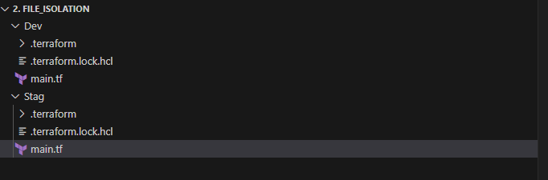
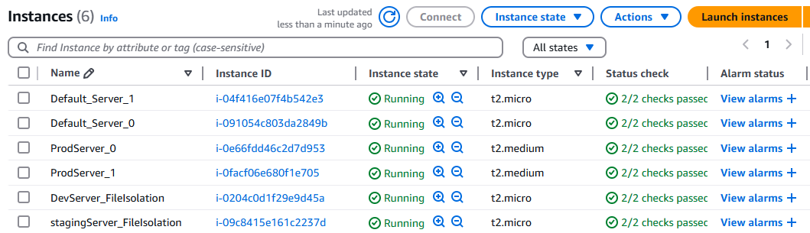
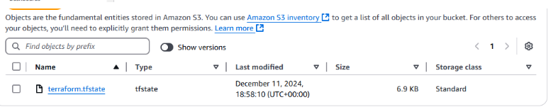

# Day 7: Understanding Terraform State

## Participant Details
- **Name:** Major Mbandi
- **Task Completed:** : Isolation via Workspaces and via File Layouts
- **Date and Time:** December 11 2000hrs

## 1. workspace isolation
### code
```HCL
terraform {
  required_version = ">= 1.0.0, < 2.0.0"

  required_providers {
    aws = {
      source  = "hashicorp/aws"
      version = "~> 4.0"
    }
  }

  backend "s3" {

    # This backend configuration is filled in automatically at test time by Terratest. If you wish to run this example
    # manually, uncomment and fill in the config below.

    bucket         = "major-s3-state-bucket-2024"
    key            = "workspace-default/terraform.tfstate"
    region         = "us-east-1"
    dynamodb_table = "majorDynamoDb-locks"
    encrypt        = true

  }
}

provider "aws" {
  region = "us-east-1"
}

resource "aws_instance" "example" {
  ami           = "ami-0453ec754f44f9a4a"

  instance_type = terraform.workspace == "default" ? "t2.micro" : "t2.medium"
  count=2

   tags = {
    Name = terraform.workspace == "default"? "Default_Server_${count.index}" : "ProdServer_${count.index}"
  }

}

```

#### Servers after deployment


## 2. File isolation
### Folder Structure on VsCode


### Code Dev Folder
```HCL
terraform {
  required_version = ">= 1.0.0, < 2.0.0"

  required_providers {
    aws = {
      source  = "hashicorp/aws"
      version = "~> 4.0"
    }
  }

  backend "s3" {

    # This backend configuration is filled in automatically at test time by Terratest. If you wish to run this example
    # manually, uncomment and fill in the config below.

    bucket         = "major-s3-state-bucket-2024"
    key            = "workspace-development/terraform.tfstate"
    region         = "us-east-1"
    dynamodb_table = "majorDynamoDb-locks"
    encrypt        = true

  }
}

provider "aws" {
  region = "us-east-1"
}

resource "aws_instance" "example" {
  ami           = "ami-0453ec754f44f9a4a"

  instance_type  = "t2.micro"

   tags = {
    Name = "DevServer_FileIsolation"
  }

}
```

### Code Stag Folder
```HCL
    terraform {
  required_version = ">= 1.0.0, < 2.0.0"

  required_providers {
    aws = {
      source  = "hashicorp/aws"
      version = "~> 4.0"
    }
  }

  backend "s3" {

    # This backend configuration is filled in automatically at test time by Terratest. If you wish to run this example
    # manually, uncomment and fill in the config below.

    bucket         = "major-s3-state-bucket-2024"
    key            = "workspace-Staging/terraform.tfstate"
    region         = "us-east-1"
    dynamodb_table = "majorDynamoDb-locks"
    encrypt        = true

  }
}

provider "aws" {
  region = "us-east-1"
}

resource "aws_instance" "example" {
  ami           = "ami-0453ec754f44f9a4a"

  instance_type  = "t2.micro"

   tags = {
    Name = "stagingServer_FileIsolation"
  }

}
```

### All state files in S3


### All server after deployment


## 3. Bonus Configure remote state storage using AWS S3
## Steps to set up remote back-end

1. Create S3 and DynamoDb table usung local state then initialize provider, plan and apply to effect changes

2. Go back and include back-end information in your main.tf file then run terraform init to force changes of backend from local to remote and push the state file to S3


### code
```HCL
    #backend information for terraform
terraform {
  backend "s3" {
    bucket = "major-s3-state-bucket-2024"
    key    = "global/s3/terraform.tfstate"
    region = "us-east-1"

    #Dynamodb settings
    dynamodb_table = "majorDynamoDb-locks"
    encrypt        = true
  }
}

#provider definition
provider "aws" {
  region = "us-east-1"
}

#S3 bucket creation
resource "aws_s3_bucket" "terraform_state" {
  bucket = "major-s3-state-bucket-2024"
  #Prevent accidental dletion of the bucket
  lifecycle {
    prevent_destroy = true
  }
}
# Enable versioning so you can see the full revision history of your state files
resource "aws_s3_bucket_versioning" "enabled" {
  bucket = aws_s3_bucket.terraform_state.id
  versioning_configuration {
    status = "Enabled"
  }
  depends_on = [aws_s3_bucket.terraform_state]
}

# Enable server-side encryption by default
resource "aws_s3_bucket_server_side_encryption_configuration" "default" {
  bucket = aws_s3_bucket.terraform_state.id

  rule {
    apply_server_side_encryption_by_default {
      sse_algorithm = "AES256"
    }
  }
}

# Explicitly block all public access to the S3 bucket
resource "aws_s3_bucket_public_access_block" "public_access" {
  bucket                  = aws_s3_bucket.terraform_state.id
  block_public_acls       = true
  block_public_policy     = true
  ignore_public_acls      = true
  restrict_public_buckets = true
}

#define DynamoDb for locking
resource "aws_dynamodb_table" "terraform_locks" {
  name         = "majorDynamoDb-locks"
  billing_mode = "PAY_PER_REQUEST"
  hash_key     = "LockID"
  attribute {
    name = "LockID"
    type = "S"
  }
}

#output
output "s3_bucket_arn" {
  value       = aws_s3_bucket.terraform_state.arn
  description = "The ARN of the S3 bucket"
}
output "dynamodb_table_name" {
  value       = aws_dynamodb_table.terraform_locks.name
  description = "The name of the DynamoDB table"
}

```
